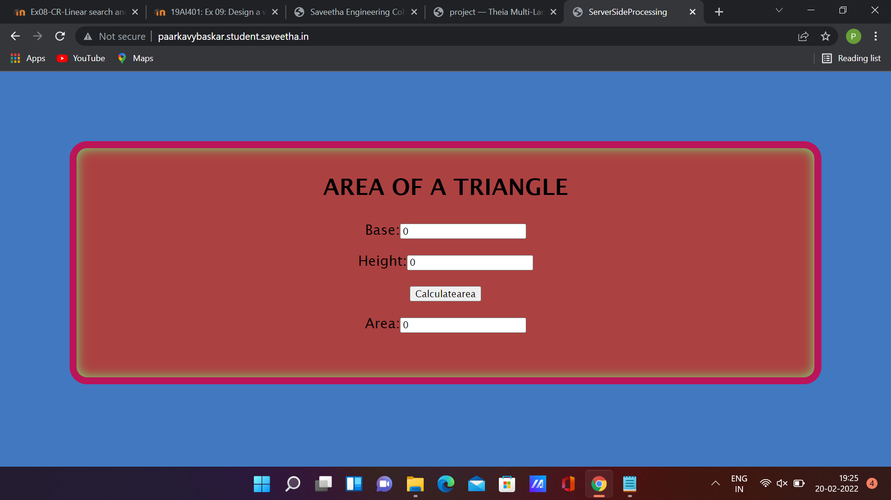

# Design a Website for Server Side Processing

## AIM:
To design a website to perform mathematical calculations in server side.

## DESIGN STEPS:

## Step 1:
Create a django project inside the pulled GitHub Repo.

## Step 2:
Insdie the project create a app called mathapp using command "sudo python3 manage.py startapp mathapp".

## Step 3:
Create a template folder inside mathapp and inside than create another folder called mathapp and inside that create a new file "area.html"

## Step 4:
Add the html conents in the area.html.

## Step 5:
Do the mathemical calculation in views.py and link the html tags.

## Step 6:
Link the html file through views.py in urls.py.

## Step 7:
Add mathapp to installed apps in setting.py and add necessary changes.

Publish the website in the given URL:http://paarkavybaskar.student.saveetha.in

## PROGRAM :
```
## area.html:

<!DOCTYPE html>
<html>
<head>
    <meta charset='utf-8'>
    <meta http-equiv='X-UA-Compatible' content='IE=edge'>
    <title>ServerSideProcessing</title>
    <meta name='viewport' content='width=device-width, initial-scale=1'>
    
</head>
<style>
    *{
        box-sizing: border-box;
        font-family:'Lucida Sans', 'Lucida Sans Regular', 'Lucida Grande', 'Lucida Sans Unicode', Geneva, Verdana, sans-serif
    }

    body{
    background-color: rgb(65, 120, 192);
    }

    .container{
    width: 1080px;
    height: 350px;
    margin-top: 100px;
    margin-left: auto;
    margin-right: auto;
    border-radius: 25px;
    border: 10px solid rgb(187, 20, 89);
    box-shadow: inset 0 0 15px rgb(111, 231, 117);
    background-color:rgb(172, 65, 65);
    }
    h1{
        text-align: center;
        padding-top: 15px;
    }
    .calculate{
        padding-top: 10px;
        padding-bottom: 10px;
        padding-left: 10px;
        padding-right:10px;
        text-align: center;
        font-size: 20px;
    }
</style>
<body>
    <div class="container">
        <h1>AREA OF A TRIANGLE</h1>
        <form method="POST">
            
            <div class="calculate"> 
                Base:<input type="text" name="base" value={{b}}></input><br/>
            </div>
            <div class="calculate">
                Height:<input type="text" name="height" value={{h}}></input><br/>
            </div>
            <div class="calculate">
                <input type="submit" value="Calculatearea"></input><br/>
            </div>
            <div class="calculate">
                Area:<input type="text" name="area" value={{area}}></input>
            </div>
        </form>
    </div>
    
</body>
</html>
```


## views.py:
```
from django.shortcuts import render

def areacalculation(request):
    context ={}
    context["area"]='0'
    context["b"]='0'
    context["h"]='0'
    if request.method == 'POST':
        
        b=request.POST.get('base','0')
        h=request.POST.get('height','0')
        area=0.5*int(b)*int(h)
        context['area'] = area
        context['b']=b
        context['h']=h
    return render(request,"mathapp/area.html",context)
```
## urls.py:
```
from django.contrib import admin
from django.urls import path
from mathapp import views

urlpatterns = [
    path('admin/', admin.site.urls),
    path('areaoftriangle/',views.areacalculation,name="areaoftriangle"),
    path('',views.areacalculation,name="areaoftriangleroot")
]
```

## OUTPUT:

Output without calculation:


Output with calculation:


## Result:
Thus a website is designed to perform mathematical calculations in serverside processing.
Host:http://paarkavybaskar.student.saveetha.in

